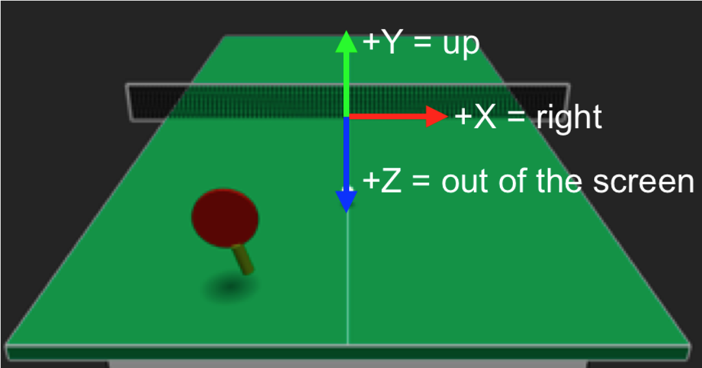

# Assignment 2:  Ping Pong 3D: An Intro to OpenGL, Points, Vectors, and Game Graphics

## Introduction
To create compelling 3D interactive computer graphics and games programmers often make use of high-performance graphics toolkits or game engines.  We will be using the graphics toolkit in this course, and this assignment will be your first significant experience with it.  You’ll use the shape classes (Box, Sphere, Cylinder, etc.) to render some simple 3D graphics, and you’ll use glm’s linear algebra package to work with 3D points, vectors, and line segments.  These will help you to compute the positions, velocities, and other quantities needed to make a simple 3D interactive ping pong game that you can play with the mouse and keyboard!

Figure 1:  Demonstration of Pong 3D.

Figure 1 shows a screen shot from an example of the Ping Pong 3D game you will create.  The ping pong table is rendered out of 3D boxes.  The paddle is made of two cylinders.  The ball is a sphere.  And the net is made of a grid of line segments.  Moving the mouse makes the paddle move side-to-side and forward-and-backward in 3D space.  Since the mouse input is only 2D and the paddle moves in 3D, we ignore the paddle’s height above the table – it always stays at a fixed height of 20 cm above the table.  When the paddle hits the ball, the ball reacts in a “physically plausible” way, updating its current velocity according to the velocity of the paddle at the time of impact.

In this assignment you should learn to:
* Use the basic_graphics toolkit to build a 3D graphics program of your own.
* Draw simple 3D geometry using the shape classes.
* Work effectively with 3D points, vectors, and other “graphics math” primitives.
* Balance the tradeoffs between realism and effective game play by simulating physics in a “plausible” but not necessarily 100% realistic way.
* Successfully program a first interactive 3D graphics game.

## Requirements and Grading Rubric
I have provided a pre-compiled binary version of our solution to the assignment so that you have an example of a successful implementation of Ping Pong 3D.  Before getting started programming, download and try out this demo program from the Moodle website.

I also provided some support code to help you get started.  This code includes the routines needed to move the 3D paddle around the screen based on mouse input and a few other routines that will help you.

The game play you are required to implement is simple relative to what it could be.  (Wizards: there’s a great opportunity here to go beyond the assignment to create a much more compelling game.)  In this assignment, all we ask you to do is have the computer put the ball into play, serving an easy-to-hit ball from the far side of the court toward you whenever you press the SPACEBAR.  You also need to program support for hitting the ball back over the net when the paddle comes into contact with it.  On the return shot, you should also detect whether the player’s shot hits the net, lands on the table, or is out of bounds.  To do all this, you’ll need to calculate collisions between the ball and the paddle, table, and net.

You should make your game as realistic as possible while also keeping in mind that we can’t treat this game as a 100% physically realistic simulation of ping pong.  A completely realistic simulation would be quite a complex simulation and it would make the game really difficult to play on a 2D computer screen – it would be too fast and too difficult to hit the ball.  Instead, we take an approach that is typical of most computer games – we balance the tradeoff between physical realism and game play.

One place where we can add some realism is in the geometry of the table, net, ball, and paddle.  You should use the exact dimensions for an official table tennis table and ball in your implementation.  The ball should have a diameter of 4cm.  Here is a diagram of the official dimensions for the table and net (courtesy Wikipedia):

Figure 2:  Ping pong dimensions (Wikipedia: http://en.wikipedia.org/wiki/Table_tennis).

The support code is setup to work in units of centimeters, matching the diagram above.  The origin of the coordinate system in the support code is at the center of the table and the top plane of the table lies within the Y=0 plane.  The X, Y, and Z axes are oriented as shown in Figure 3.

Figure 3:  3D coordinate system.  Note the origin (0,0,0) lies on the top surface of the table right in the center of the table.

While we can make the geometry match the real world, we will need to make a few simplifying assumptions about the physics.  Specifically, you should follow these guidelines in your code:

1. Ignore the height of the paddle above the table when you calculate a collision between the paddle and the ball.  It’s too difficult to control the height of the paddle with a 2D mouse-based interface, so the support code always keeps it at a fixed height of 20cm above the table.  If the X and Z positions of the ball and paddle indicate a collision, then you should treat it as a collision even if the height of the ball is technically above or below the paddle.
2. Slow down time – playing at real life speed is too fast and makes debugging really difficult.  See the note in the onSimulation() function in the support code that shows how to slow down the simulation time.
3. To simulate friction etc. you can simply decrease the speed of the ball a bit when it hits the table.  For example, you might make the speed after bouncing 0.85 times the speed before the bounce.
4. Watch out for virtual balls penetrating virtual paddles and tables. If you update your simulation once each frame that means the “timestep” of your simulation (i.e., the “delta t” (dt) time between each frame) will be somewhere around 1/30 – 1/60 second.  That’s fast, but still not fast enough to capture the exact moment when the ball first makes contact with the paddle.  This means that if you update the position of the ball using pnew = pold + dt*(v + 0.5*dt*a) with v=velocity and a=acceleration due to gravity, you may have a situation where the ball had not yet reached the paddle at the last timestep that you simulated but at the next timestep the ball has not only reached the paddle but has passed through it!  Of course, this cannot happen in real life, but in computer graphics, a virtual ball could actually penetrate a virtual paddle unless you detect this situation and correct for it.  Figure 4 demonstrates this situation.  When you detect this situation, you can correct for it by simply setting pnew to a value that places the ball just outside of the paddle, as shown in Figure 4.

Figure 4: In a computer graphics simulation you might encounter a situation where the virtual ball penetrates the virtual paddle.  This can’t happen in real life, but it can happen when simulating physics on a computer.

A more specific list of requirements follows.  I will use this list in my grading, so this also serves as a grading rubric.  To get a 100% on the assignment, you need to correctly implement everything that is listed here.  You’ll find that the requirements are ordered very conveniently here… almost like a set of steps that you should take to complete the assignment.  I recommend starting at the top and going down the list as you work.

1. Draw the 3D ping pong table and ball with appropriate dimensions.
2. Make the ball move through the air based on an initial velocity and restart the ball when the SPACEBAR key is pressed.
3. Update the ball’s position and velocity each timestep based on acceleration due to gravity.
4. Respond to a contact between the ball and the table by making the ball bounce.
5. Make the ball bounce off the table in the correct direction – i.e., the ball’s velocity vector should be reflected about the normal of the table.
5. Detect when the ball falls off the table and avoid bouncing in this situation.
6. Decrease the speed of the ball when it bounces on the table – this is due to friction and other factors, but you do not need to simulate these; just decrease the speed by some constant factor.
7. Respond to a contact between the ball and the net.
8. Respond to a contact between the ball and the paddle.
9. Make the ball bounce off the paddle in the correct direction – i.e., the ball’s velocity vector should be reflected about the normal of the paddle.
10. Also incorporate the velocity of the paddle into the way the ball responds when hit, i.e., if the paddle velocity has a big component in the positive X direction, then this should make the ball move in that direction after it is hit.
11. Use a non-uniform weighting (a different weight applied to the X, Y, and Z components) when transferring the paddle’s velocity to the ball in order to make it easier to hit angled shots.
12. Respond to a contact between the ball and the paddle even when the paddle is moved so fast that it “skips” over the ball (see technical discussion below).
13. Make the ball animate in a physically plausible way after it hits the net.
14. Print out prompts to the terminal (or screen) to indicate who won the point once it is complete (i.e., Nice shot – your point!, Out of bounds – opponent’s point, Hit the net – opponent’s point, Bounced on your side before going over the net – opponent’s point).
15. Draw shadows for the ball and the paddle when they are over the table.  Hint: you can draw a “fake” shadow simply by drawing a circle using a triangle fan and positioning the circle directly under the ball or the paddle.  Give the shadow a height that is just a tiny bit higher than the height of the table, otherwise and the table and shadow are at exactly the same height, the graphics engine will not know which is on top of the other.

## Additional Technical Background and Tips
Once you handle the easier case of the ball hitting the paddle when the paddle is not moving very quickly, you will also want to handle the more complex scenario diagramed below in Figure 5.  When the paddle is moving very quickly due to the user moving his/her mouse very fast, it is possible to have a situation where the paddle “skips” over the ball.  In other words, at one timestep (time 0) the ball has not yet reached the paddle, but at the next timestep (time 1), after updating the paddle’s position based on the user’s latest mouse movement, we notice that the paddle is now in front of the ball.  This would not have happened in real life – the paddle should have hit the ball at some time between time 0 and time 1.

Figure 5:  If the paddle is moving very fast, it’s possible for the paddle to “skip” right over the ball so that there is never a frame when the geometries of the paddle and the ball actually intersect in 3D space.

To handle this case properly, you need to check to see if the ball would have been hit at any of the paddle positions between time 0 and time 1.  There are a few different ways that you might do this.  We’ll discuss one strategy in class!

## Wizards
All of the assignments in the course will include great opportunities for students to go beyond the requirements of the assignment and do cool extra work.  I don’t offer any extra credit for this work – if you’re going beyond the assignment, then chances are you are already kicking butt in the class.  However, I do offer a chance to show off… while grading the assignments I will identify the best 4 or 5 examples of people doing cool stuff with computer graphics.  We’ll call these students our “wizards”, and after each assignment, the students selected as wizards will get a chance to demonstrate their programs to the class!

There are some great opportunities for wizardly work in this assignment.  Turn this program into a more exciting game!  Implement a paddle for the opponent!  Keep score!  Add some spin to the ball!

## Getting Started with Support Code

Support code has been provided for you. Once you have extracted the files, follow the steps for ["Creating your own graphics program"](https://docs.google.com/document/d/1eAPJK8-5PVgs30_pSBYFUQDQ6vxPnC1iGEfDeVRvSkw/edit?usp=sharing) to modify the cmakelist.txt file and use cmake to generate a build project.

The support code for this assignment is a simple app based on the basic_graphics example discussed in class.  The support code includes the user interface code needed to move your paddle around the scene and sets up a camera view that will work well if you draw a table in your scene according to the specifications described above.  This should give you a good start on the assignment!

## Handing In
Before submitting your assignment, you should edit this README file.  At the top of the file before the introduction section, you should include, at a minimum, your name, your partner’s name, and descriptions of design decisions you made while working on this project. If you attempted any “Wizard” work, you should note that in this file and explain what you attempted.

